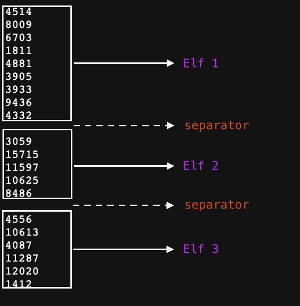

# Explanation for Day 1

Question can be found [here](https://adventofcode.com/2022/day/1)

## Interesting concepts

- Reading [File](https://api.dart.dev/stable/2.18.5/dart-io/File-class.html) input in dart
- Using functions like `split` on strings, `int.parse` and `sort` on [List](https://api.dart.dev/stable/2.18.5/dart-core/List-class.html)
- Using both of these concepts together to make sense of the input.

## Approach

### Reading the input and making sense of it

When we click on [get your puzzle input](https://adventofcode.com/2022/day/1/input), you get a website, which has some weirdly grouped list of numbers. If you have gone through the question, this is what this list means.


- Each block is list of calories carried by an elf, sum of this block gives us the total calories carried by the elf
- An empty line between two such blocks is the separator. We use this separator to somehow extract information about individual elf.
- Copy paste all the text in the webpage, and save it as a `.txt` file. In this
  case I have saved it as `input_day_1.txt`.

### Code for reading file

```dart
  final directory = Directory.current.path;
  final fileString =
      File('$directory/inputs/input_day_1.txt').readAsStringSync();
```

- `Directory.current.path` gives the root of the file where you are running this code. For eg, the file `day_1.dart` is placed on my system in `/Users/chinmaykabi/personal/aoc_dart`. So `Directory.current.path` returns `/Users/chinmaykabi/personal`. We append the `/inputs/input_day_1.txt` guiding it towards the input file

- `File(PATH_NAME)` creates a file object which can be used to perform various file operations, in this case, reading the file as a string.
- There are two ways we can read as strings, `readAsString` and `readAsStringSync`. I have used `readAsStringSync` for simplicity sake, but for very large files, it is always a good practice to use `readAsString`, as it does not block the execution of your code. Learn more about [Future here](https://dart.dev/codelabs/async-await)

#### The magic of `'\n'`

If you were to type the following numbers

```
4514
8009
6703
```

You will enter as follows

- 4514 _Press enter key_
- 8008 _Press enter key_
- 6703 _Press enter key_

For computer, the equivalent of _Press enter key_ is `'\n'`. So if we look for `'\n\'` to see if there is a change in line.

Earlier we saw that between two sets of inputs, there was one empty line. that can be interpreted as enter key pressed twice, or `'\n\n'`. So in between two `'\n\n'` lies the info of one elf.

#### split in action

- `split()` can split a string into smaller strings, based on the pattern that is passed to the function to split over.
- For eg, `Hello+World` when split using `split('+')` will return a list of string, `["Hello", "World"]`.
- So if we split our string containing contents of the file over `'\n\n'`, that returns a list of calories, grouped elves wise

#### Sum of calories for each elf

- We iterate over the list we got after `split('\n\n')`, each item gives us list of calories of a single elf, which again is a string.
- This string is nothing but a list of numbers, with `'\n` in between them
- Splitting this string over `'\n` gives us the individual calories from the list. Note that this value is in string
- We use `int.parse()` to convert this string into number. Learn more about it [here](https://api.flutter.dev/flutter/dart-core/int/parse.html)
- Save a sum of these values to get total calories for each elf.
- Add this value to a list of int, in this case to `elvesCalories` to keep track of total calories of each elf
- Use `sort()` to arrange this list of int in ascending order. [Sort](https://api.flutter.dev/flutter/dart-core/List/sort.html) is a very powerful function, reading about it helps a lot when working on production grade applications.

### Getting the ✨

- First question asked what was the highest amount of calorie present with an elf
- In a ascending order list, largest number is always at the end, so the last element of this list is the answer

- Second question asked sum of top 3 calories, which will be the sum of last 3 elements of this list

### Improvements

- Functions like `map()`, `reduce()` can be used to write more concise code for parsing the input file.

```dart
final elvesCalories = elvesGroups
      .map((e) => e
          .split('\n')
          .map((e) => int.parse(e))
          .reduce((value, element) => value + element))
      .toList();
```
